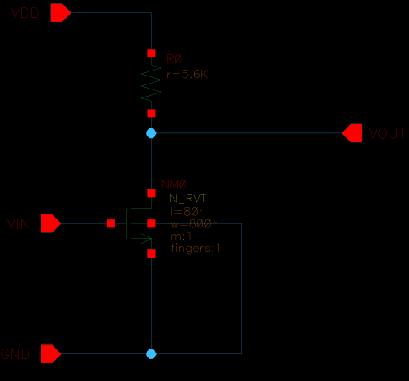

# Circuit Design Fundamentals

디지털 RTL과 아날로그 CMOS 회로에서 발생하는 설계 문제를 시뮬레이션 결과와 함께 정리한 **읽기용 회로 설계 포트폴리오**이다.

이 저장소는 특정 EDA 환경을 그대로 배포하거나 독자가 모든 실습을 재실행하도록 만드는 것을 목표로 하지 않는다. 각 프로젝트의 대표 README에서 **구조 → 설계 목표 → 실험 조건 → 결과 → 해석**의 흐름을 읽을 수 있도록 구성한다.

## Featured Studies

| 영역 | 대표 실습 | 확인하는 내용 | 주요 근거 |
|---|---|---|---|
| Analog | [Resistive-Load Common-Source](./analog/projects/01_single_stage_amplifier_topologies/01_cs_resistive_load/README.md) | DC bias, small-signal gain, bandwidth, gain compression, clipping | Virtuoso schematic, Spectre 결과, SVG/CSV |
| Digital | [CDC, ICG, FIFO](./digital/README.md) | clock-domain crossing, glitch-free clock gating, synchronous/asynchronous FIFO | Verilog RTL, testbench, waveform 기반 해석 |

## Analog CMOS Design

<p align="center">
  
</p>

현재 공개된 아날로그 대표 실습은 저항 부하 NMOS common-source 증폭기이다. 단순히 회로를 구성하는 데서 끝내지 않고 하나의 동작점을 기준으로 DC, AC와 transient 결과를 연결한다.

```text
목표 ID와 VOUT 설정
    ↓
DC sweep과 부하선으로 RD, VIN_BIAS 결정
    ↓
Operating point에서 gm, ro, saturation margin 확인
    ↓
AC analysis로 gain과 CL-dependent bandwidth 측정
    ↓
Transient에서 small-signal 결과 검증
    ↓
입력 진폭 sweep으로 gain compression, THD, clipping 분석
```

대표 결과는 다음과 같다.

| 항목 | 결과 |
|---|---:|
| VDD / RD | 1.1 V / 5.6 kΩ |
| ID / VOUT | 약 98.21 µA / 0.550 V |
| 저주파 gain | 약 2.268 V/V |
| `CL=100 fF` -3 dB bandwidth | 약 365.2 MHz |
| Gain compression 시작 관찰 | 약 180 mV peak |
| `380 mV peak` 출력 범위 / THD | 약 0.152–1.092 V / 16.63% |

이 실습에서는 `RD=1 kΩ`에서 목표 전류와 출력 bias를 동시에 만족할 수 없음을 확인하고, 부하선 계산으로 `RD≈5.5 kΩ`를 구한 뒤 `5.6 kΩ`으로 보정한다. 이후 같은 동작점에서 부하 커패시턴스, 입력 주파수와 진폭을 바꾸며 선형 모델의 유효 범위와 출력 headroom을 확인한다.

전체 과정과 회로도, testbench 및 결과 그래프는 [1-1 대표 문서](./analog/projects/01_single_stage_amplifier_topologies/01_cs_resistive_load/README.md)에서 확인한다.

## Digital RTL Design

디지털 영역은 서로 다른 구현을 같은 조건에서 비교하고 waveform 또는 self-checking testbench로 차이를 확인하는 프로젝트로 구성한다.

| 주제 | 핵심 관찰점 |
|---|---|
| CDC behavioral models | setup/hold violation model, metastability resolution, 2-FF synchronizer, pulse/toggle, handshake, Gray-pointer FIFO, reset crossing |
| Clock-gating ICG experiment | naive AND의 glitch, latch-based ICG, FF-based latency, test enable |
| FIFO design models | synchronous FIFO, valid-ready backpressure, Gray-pointer asynchronous FIFO와 clock ratio |

각 프로젝트의 RTL 구조와 scenario별 관찰 지점은 [Digital Design](./digital/README.md)에서 확인한다.

## How to Read

1. 영역별 대표 README에서 회로 또는 RTL 구조와 실험 질문을 확인한다.
2. 세부 문서에서 조건을 선택한 이유와 계산 과정을 확인한다.
3. schematic, waveform, SVG plot과 측정 표를 함께 보며 결과를 해석한다.
4. 마지막으로 설계 변수에 따른 gain, bandwidth, power, latency, headroom과 reliability의 trade-off를 정리한다.

프로젝트에 포함된 netlist template과 분석 스크립트는 결과가 어떤 방식으로 만들어졌는지를 남기기 위한 기록이다. 저장소 자체를 독립적인 실행 환경으로 제공하는 것은 아니다.

## Repository Map

```text
digital/
  projects/        # CDC, ICG, FIFO RTL 실습
  concepts/        # 실습 해석에 필요한 보조 개념

analog/
  projects/        # 증폭기와 analog building block 실습
  sim/             # 결과 생성에 사용한 공통 자동화 기록
  ROADMAP.md       # 아날로그 실습 진행 순서
```

- [Analog Design](./analog/README.md)
- [Digital Design](./digital/README.md)
- [Analog Practice Roadmap](./analog/ROADMAP.md)

## Tools and Evidence

| 영역 | 사용 환경 | 저장소에 남기는 근거 |
|---|---|---|
| Digital | Verilog, Cadence Xcelium, SimVision | RTL, testbench, scenario 설명, waveform 해석 |
| Analog | Cadence Virtuoso IC6.1.8, Spectre 21.1, UMC 40 nm PDK | schematic SVG, 측정 CSV, 결과 SVG, 설계 과정 문서 |

## Scope and Artifact Policy

- PDK, transistor model, license, Virtuoso OA database와 EDA raw result는 공개하지 않는다.
- 공개 결과는 문서에 명시된 simulation 환경과 nominal 조건에서 얻은 값이다.
- 코드와 스크립트는 설계 의도와 검증 방법을 보여 주기 위한 보조 자료이다.
- 미완료 회로는 검증된 결과처럼 표시하지 않고 roadmap 또는 후속 실습으로 구분한다.
- 각 대표 문서는 결과값만 나열하지 않고 해당 결과가 나온 원인과 다음 설계 판단을 함께 설명한다.
