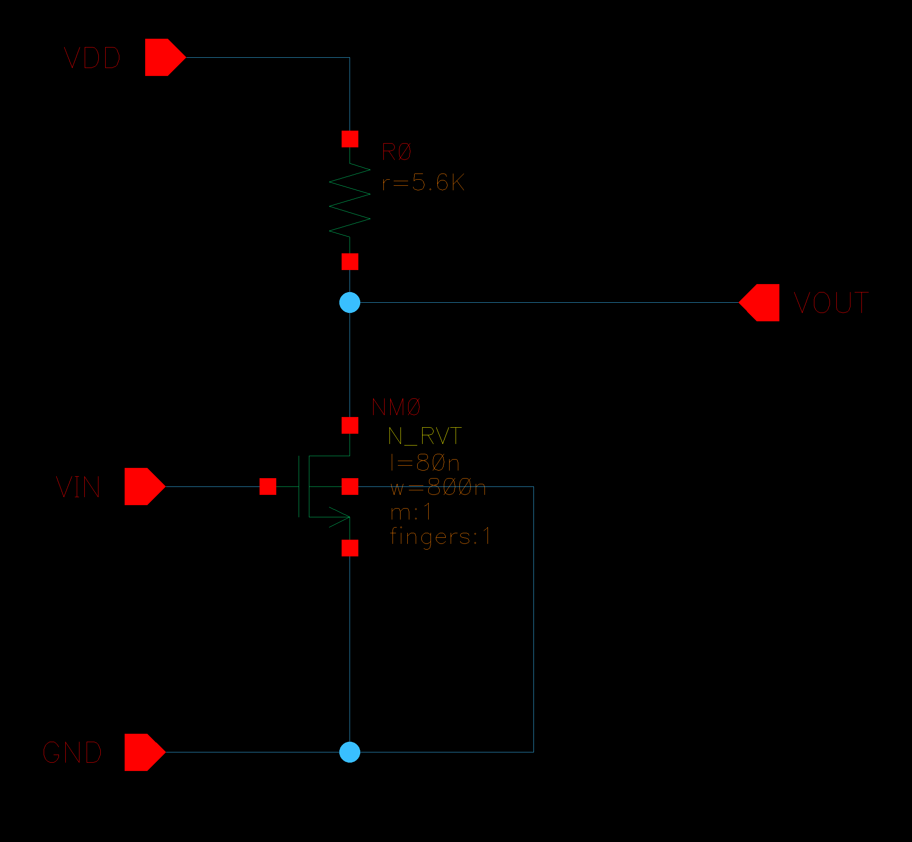
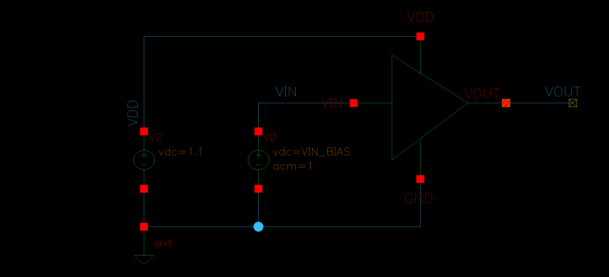
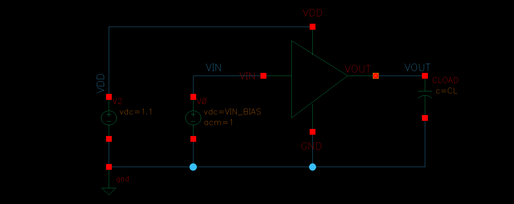
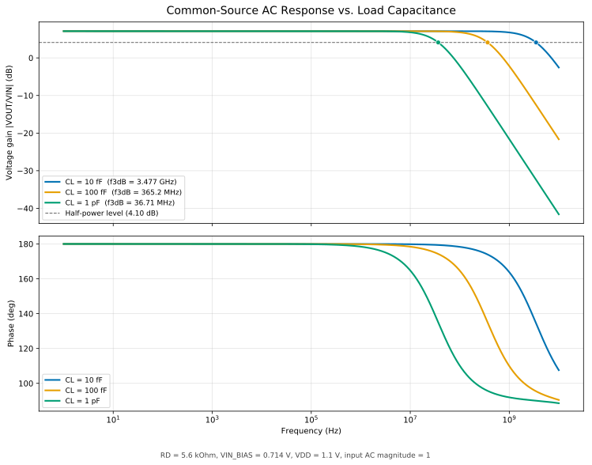
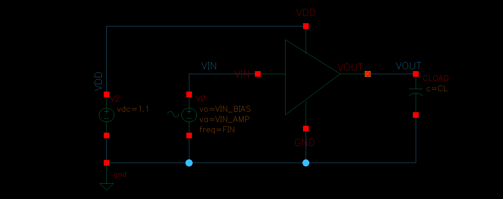
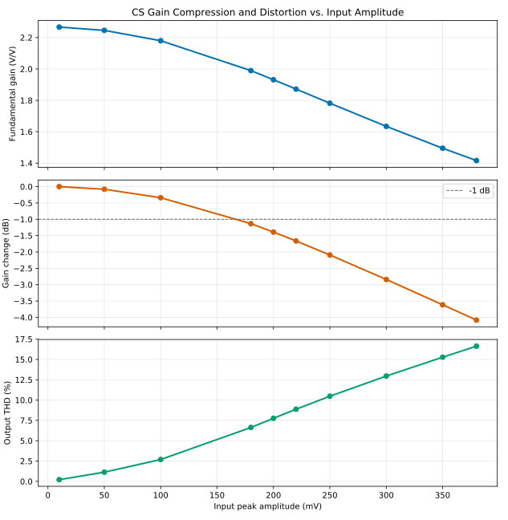
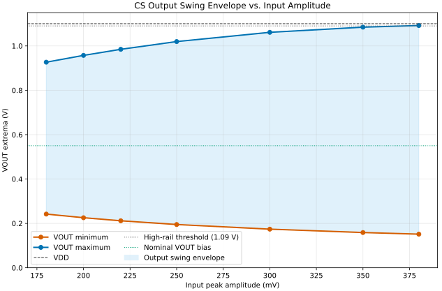
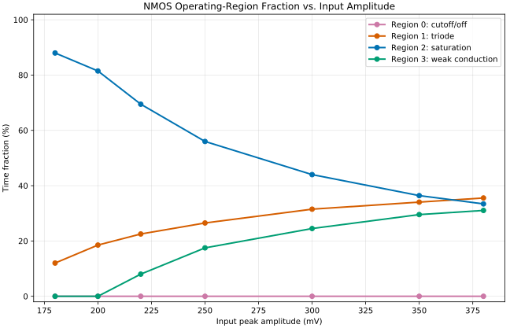

# Resistive-Load Common-Source 실습

## 1. 실습의 전체 흐름

이 실습은 저항 부하 NMOS common-source 증폭기를 구성한 뒤, 하나의 기준 동작점에서 DC, AC와 transient 해석을 순서대로 연결한 것이다.

```text
설계 목표 설정
    ↓
DC sweep으로 ID와 VOUT의 관계 확인
    ↓
목표 동작점을 만족하도록 RD와 VIN_BIAS 결정
    ↓
Operating point에서 gm, ro와 saturation margin 확인
    ↓
AC analysis로 small-signal gain과 bandwidth 확인
    ↓
Transient analysis로 AC 결과를 시간 영역에서 검증
    ↓
입력 진폭 sweep으로 gain compression과 THD 확인
    ↓
MOS 동작영역과 연결하여 clipping 원인 분석
```

각 해석은 독립적인 실험이 아니다. DC 해석으로 정한 동작점에서 회로가 선형화되며, 그 결과가 AC gain과 bandwidth를 결정한다. Transient 해석은 이 small-signal 결과가 실제 파형에서도 재현되는지 확인하고, 입력 진폭 sweep은 small-signal 가정이 깨지는 범위를 보여 준다.

## 2. 기준 회로와 설계 목표

### 2-1. 회로 구조

<p align="center">
  
</p>

*그림 1. `cdf_analog_sandbox/cs_resistive_load` DUT schematic*

입력이 증가하면 NMOS drain current가 증가하고 `RD`의 전압 강하가 커지므로 출력은 감소한다. 따라서 이 회로는 반전 전압 증폭기이다.

### 2-2. 목표와 최종 기준값

| 항목 | 기준값 |
|---|---:|
| VDD | 1.1 V |
| 목표 drain current | 약 100 µA |
| 목표 output bias | 약 0.55 V |
| NMOS W/L | 800 nm / 80 nm |
| RD | 5.6 kΩ |
| VIN_BIAS | 0.714 V |
| Nominal CL | 100 fF |
| 실제 ID | 98.21 µA |
| 실제 VOUT | 0.5500 V |

`VOUT≈VDD/2`는 출력을 supply 중앙 부근에 두어 위쪽과 아래쪽으로 움직일 전압 여유를 확보하기 위한 시작점이다. 다만 rail까지의 거리가 같다는 사실만으로 선형 출력 swing까지 대칭이 되는 것은 아니다. 아래쪽 한계에는 NMOS의 saturation 조건이, 위쪽 한계에는 NMOS의 weak conduction과 `VDD`가 관여한다.

### 2-3. Virtuoso 구성

| 구분 | Library / Cell | 사용 해석 |
|---|---|---|
| DUT | `cdf_analog_sandbox/cs_resistive_load` | 공통 |
| DC testbench | `cdf_analog_tb/tb_p01_cs_basic` | OP + DC sweep |
| AC testbench | `cdf_analog_tb/tb_p01_cs_ac` | OP + AC + CL sweep |
| Transient testbench | `cdf_analog_tb/tb_p01_cs_transient` | Transient + amplitude sweep |

Virtuoso OA cell은 공용 sandbox와 testbench library에 두고, 이 프로젝트 디렉터리에는 재현 가능한 스크립트, 결과 그림과 문서를 보관한다.

## 3. Step 1: DC 동작점 설정

<p align="center">
  
</p>

*그림 2. `tb_p01_cs_basic`: `VIN_BIAS`를 sweep하여 `ID`와 `VOUT`을 결정하는 testbench*

저항 부하 CS의 DC 관계는 다음과 같다.

```text
VOUT = VDD - ID × RD
```

`VIN_BIAS`는 NMOS의 `VGS`와 drain current를 주로 결정하고, `RD`는 그 전류를 출력 전압으로 변환한다. 따라서 `VIN_BIAS`만 조절해서 목표 전류와 목표 출력 전압을 서로 독립적으로 맞출 수는 없다.

### 3-1. RD=1 kΩ에서 확인한 문제

첫 sweep에서 `ID≈100.08 µA`가 되는 입력은 약 `0.685 V`였지만 출력은 약 `0.9999 V`였다.

```text
VOUT ≈ 1.1 V - 100 µA × 1 kΩ
     ≈ 1.0 V
```

즉, `RD=1 kΩ`에서는 목표 전류를 흘려도 저항의 전압 강하가 약 `0.1 V`에 불과하여 출력을 `0.55 V`까지 내릴 수 없다.

### 3-2. 목표값으로 RD 역산

```text
RD = (VDD - VOUT) / ID
   = (1.1 V - 0.55 V) / 100 µA
   = 5.5 kΩ
```

근접한 값인 `5.6 kΩ`을 선택하고 `VIN_BIAS`를 다시 sweep하였다. 그 결과 `VIN_BIAS=0.714 V`에서 `ID≈98.21 µA`, `VOUT≈0.55 V`를 동시에 만족하였다.

이 과정의 핵심은 다음과 같다.

1. 목표 `ID`와 `VOUT`으로 부하선의 시작값을 계산한다.
2. PDK transistor model을 사용한 DC sweep으로 실제 동작점을 확인한다.
3. channel-length modulation과 model 비이상성 때문에 생기는 차이를 bias로 보정한다.
4. 최종 operating point에서 MOS가 saturation인지 확인한다.

상세 과정은 [01. DC 동작점 설정](./docs/01_cs_resistive_load_bias_setup.md)에 정리되어 있다.

## 4. Step 2: Operating point와 small-signal 이득

최종 DC 동작점에서 확인한 주요 parameter는 다음과 같다.

| 항목 | 결과 |
|---|---:|
| gm | 528.39 µS |
| gds | 52.73 µS |
| ro=1/gds | 18.97 kΩ |
| VOV | 0.2079 V |
| VDSAT | 0.1749 V |
| VDS−VDSAT margin | 약 0.375 V |
| 동작영역 | saturation |

저주파 small-signal 이득은 다음과 같이 근사할 수 있다.

```text
Rout ≈ RD || ro
     ≈ 5.6 kΩ || 18.97 kΩ
     ≈ 4.323 kΩ

Av ≈ -gm(RD || ro)
   ≈ -2.284 V/V
```

Spectre 결과는 `-2.268 V/V`, 즉 magnitude `7.111 dB`로 손계산과 잘 일치하였다. 여기서 `RD`만이 아니라 transistor의 유한한 `ro`도 출력 저항과 이득을 제한한다.

이 결과는 DC 동작점 주변에서 구한 **국소 기울기**이다. 입력 진폭이 충분히 작을 때만 하나의 고정된 `gm`, `gds`로 회로를 설명할 수 있다.

## 5. Step 3: 부하 커패시턴스와 bandwidth

<p align="center">
  
</p>

*그림 3. `tb_p01_cs_ac`: AC magnitude가 1인 입력과 가변 `CL`을 사용한 testbench*

`CL={10 fF, 100 fF, 1 pF}`로 바꾸어 AC response를 비교하였다.

| CL | 저주파 이득 | -3 dB bandwidth | Unity-gain frequency |
|---:|---:|---:|---:|
| 10 fF | 2.268 V/V | 3.477 GHz | 7.077 GHz |
| 100 fF | 2.268 V/V | 365.2 MHz | 743.3 MHz |
| 1 pF | 2.268 V/V | 36.71 MHz | 74.71 MHz |



`CL`은 DC에서 open circuit이므로 DC bias와 저주파 gain은 거의 바꾸지 않는다. 반면 출력 node의 pole은 대략 다음 관계를 따른다.

```text
fp ≈ 1 / (2πRoutCL)
```

따라서 `CL`이 10배 증가할 때 bandwidth는 거의 10분의 1로 감소하였다. 이 결과는 더 큰 부하를 구동하면 같은 DC gain을 유지하더라도 응답 속도가 느려진다는 의미이다.

상세 결과는 [02. AC 응답](./docs/02_cs_ac_response.md)에 정리되어 있다.

## 6. Step 4: AC 결과의 transient 검증

<p align="center">
  
</p>

*그림 4. `tb_p01_cs_transient`: 입력 주파수와 진폭을 변수로 둔 testbench. 같은 회로를 gain compression과 clipping sweep에도 사용한다.*

AC analysis는 DC 동작점에서 선형화된 회로의 주파수 응답이다. 이를 실제 시간 파형에서 확인하기 위해 `10 mV peak`의 작은 sine 입력을 사용하였다.

| 입력 주파수 | 출력 진폭 | Gain | Gain (dB) | 출력 위상 |
|---:|---:|---:|---:|---:|
| 1 MHz | 22.667 mV | 2.2667 V/V | 7.108 dB | 179.84° |
| 365.235 MHz | 16.029 mV | 1.6029 V/V | 4.098 dB | 134.94° |

`1 MHz` 결과는 AC 저주파 gain인 `2.268 V/V`와 일치하였다. `365.235 MHz`에서는 gain이 저주파의 `0.7071배`로 감소하여 AC에서 구한 -3 dB 지점이 transient에서도 재현되었다.

이 비교를 통해 다음을 확인하였다.

1. AC 해석의 이득은 충분히 작은 입력의 transient 결과와 일치한다.
2. CS 출력은 입력에 대해 약 `180°` 반전된다.
3. Pole 부근에서는 진폭 감소와 추가 위상 지연이 함께 나타난다.

상세 결과는 [03. Transient 검증](./docs/03_cs_transient_verification.md)에 정리되어 있다.

## 7. Step 5: Gain compression과 distortion

주파수를 `1 MHz`로 고정하고 입력 진폭을 증가시켜 small-signal 가정이 깨지는 과정을 확인하였다.

| VIN peak | Fundamental gain | Gain 변화 | VOUT THD | Saturation 비율 |
|---:|---:|---:|---:|---:|
| 10 mV | 2.2667 V/V | 0.000 dB | 0.213% | 100.0% |
| 50 mV | 2.2458 V/V | -0.080 dB | 1.134% | 100.0% |
| 100 mV | 2.1798 V/V | -0.340 dB | 2.691% | 100.0% |
| 200 mV | 1.9313 V/V | -1.391 dB | 7.761% | 81.5% |

`50 mV`와 `100 mV`에서는 NMOS가 한 주기 내내 saturation을 유지하지만 gain이 감소하고 THD가 증가한다. 이는 saturation이 곧 완전한 선형 영역이라는 뜻은 아니기 때문이다. 입력이 크게 움직이면 순간 `gm`, `gds`와 전달 특성의 기울기가 계속 달라진다.

`200 mV`에서는 saturation 이탈까지 발생하여 compression과 distortion이 더 빠르게 증가한다. 따라서 large-signal 한계는 다음 두 단계로 이해할 수 있다.

1. 같은 동작영역 안에서도 transistor 비선형성으로 distortion이 증가한다.
2. Headroom이 부족해 동작영역이 바뀌면 gain compression과 clipping이 더욱 커진다.

상세 결과는 [04. Gain compression](./docs/04_cs_gain_compression.md)에 정리되어 있다.

## 8. Step 6: 양쪽 clipping 원인

입력 진폭을 `180~380 mV peak`로 확장하여 출력의 아래쪽과 위쪽 한계를 분리해 확인하였다.







### 8-1. Low-side 한계

입력이 증가하면 `ID`가 커지고 `VOUT`이 낮아진다. `VDS<VDSAT`가 되면 NMOS가 triode로 이동하며 더 이상 small-signal gain을 유지하지 못한다. 이 현상은 `180 mV peak`부터 관찰되었다.

### 8-2. High-side 한계

입력이 감소하면 NMOS 전류가 작아지고 `VOUT`이 `VDD`에 접근한다. NMOS가 weak conduction 또는 cutoff에 가까워지면서 출력 위쪽이 눌린다. Weak-conduction 구간은 `220 mV peak`부터 나타났고, `380 mV peak`에서는 출력 최대값이 약 `1.092 V`에 도달하였다.

### 8-3. 최종 대신호 결과

| VIN peak | Gain | THD | VOUT 범위 | Triode | Saturation | Weak conduction |
|---:|---:|---:|---:|---:|---:|---:|
| 180 mV | 1.9893 V/V | 6.631% | 0.242~0.927 V | 12.0% | 88.0% | 0.0% |
| 250 mV | 1.7817 V/V | 10.477% | 0.195~1.020 V | 26.5% | 56.0% | 17.5% |
| 380 mV | 1.4163 V/V | 16.630% | 0.152~1.092 V | 35.5% | 33.4% | 31.0% |

이 회로에서는 low-side triode 진입이 먼저 발생한다. 출력 bias를 `VDD/2`에 두었더라도 transistor의 saturation 조건과 cutoff 조건이 rail을 기준으로 대칭이 아니기 때문이다.

상세 결과는 [05. Clipping sweep](./docs/05_cs_clipping_sweep.md)에 정리되어 있다.

## 9. 설계 변수와 관찰되는 trade-off

| 설계 변수 | 직접적인 영향 | 함께 확인할 항목 |
|---|---|---|
| `VIN_BIAS` | `VGS`, `ID`, `VOUT` | `gm`, saturation margin, quiescent power |
| `RD` | 전압 강하, output bias, 저주파 gain | headroom, output resistance, bandwidth |
| NMOS `W/L` | 같은 bias에서의 전류와 `gm` | 기생 capacitance, 입력 capacitance, 면적 |
| `CL` | 출력 pole과 settling 속도 | -3 dB bandwidth, phase delay |
| `VDD` | 사용 가능한 전체 headroom | power, output swing, bias 재설정 |
| 입력 진폭 | 출력 swing 요구량 | gain compression, THD, 동작영역 이탈 |

`RD`를 증가시키면 일반적으로 저주파 gain을 높일 수 있지만, 같은 전류에서 더 큰 DC 전압 강하가 발생하여 output bias와 headroom이 달라진다. 또한 출력 저항이 증가하면 같은 `CL`에서 pole이 낮아질 수 있다. 하나의 parameter를 조절할 때 gain만 보는 것이 아니라 bias, swing과 bandwidth를 함께 확인해야 한다.

## 10. 실습에서 얻은 핵심 결론

1. 회로 설계는 transistor 크기를 임의로 조정하는 것보다 목표 전류, 출력 bias와 부하 관계를 먼저 계산하는 것에서 시작한다.
2. `VIN_BIAS`는 전류를, `RD`는 전류에 따른 출력 전압을 주로 결정하지만 두 값은 MOS 비이상성 때문에 완전히 독립적이지 않다.
3. Operating point의 `gm`과 `ro`가 small-signal gain을 결정하며, 손계산과 PDK simulation을 비교해 모델을 검증할 수 있다.
4. 부하 커패시턴스는 DC gain보다 bandwidth에 직접적인 영향을 준다.
5. AC analysis는 동작점 주변의 선형 응답이며, transient small-signal 결과와 일치해야 한다.
6. MOS가 saturation을 유지해도 large-signal distortion은 발생할 수 있다.
7. Hard clipping에 도달하기 전에 gain compression과 THD가 먼저 성능 한계를 만든다.
8. 출력 bias가 supply 중앙에 있어도 실제 선형 swing은 transistor headroom 조건 때문에 비대칭일 수 있다.

## 11. 다음 회로와의 비교 기준

다음 실습인 PMOS current-source load CS에서는 가능한 한 다음 조건을 동일하게 유지한다.

- `VDD=1.1 V`
- 같은 NMOS 크기
- `ID≈100 µA`
- `VOUT≈0.55 V`
- 동일한 `CL`

저항을 PMOS current-source load로 교체하면 부하의 small-signal output resistance가 커져 gain이 증가할 수 있다. 반면 PMOS도 saturation을 유지해야 하므로 위쪽 headroom이 추가로 필요하고, 높은 output resistance와 기생 capacitance로 인해 bandwidth가 달라질 수 있다.

따라서 다음 항목을 저항 부하 결과와 비교한다.

1. DC bias를 맞추는 방법: `RD` 계산과 `VBP` 조절의 차이
2. 저주파 gain과 output resistance
3. 부하 커패시턴스가 같을 때의 bandwidth
4. NMOS와 PMOS가 동시에 saturation을 유지하는 output swing
5. 입력 진폭에 따른 gain compression과 THD

저항 부하 CS는 이후 능동 부하 증폭기의 이득, headroom과 bandwidth trade-off를 판단하기 위한 기준 회로이다.

## 12. 문서와 재실행 경로

| 순서 | 문서 | 역할 |
|---:|---|---|
| 1 | [DC 동작점 설정](./docs/01_cs_resistive_load_bias_setup.md) | 목표 `ID`, `VOUT`을 만족하는 `RD`, `VIN_BIAS` 결정 |
| 2 | [AC 응답](./docs/02_cs_ac_response.md) | `gm`, `ro`, gain과 `CL`에 따른 bandwidth 확인 |
| 3 | [Transient 검증](./docs/03_cs_transient_verification.md) | AC gain과 -3 dB 지점을 시간 영역에서 검증 |
| 4 | [Gain compression](./docs/04_cs_gain_compression.md) | 입력 진폭 증가에 따른 비선형성 확인 |
| 5 | [Clipping sweep](./docs/05_cs_clipping_sweep.md) | Low-side와 high-side 출력 한계 분석 |

DUT와 testbench schematic 이미지는 별도의 read-only Virtuoso 세션에서 자동 생성한다.

```bash
./scripts/export_schematics.sh
```

Transient와 대신호 결과는 다음 명령으로 다시 생성한다.

```bash
./scripts/run_cs_transient.sh
```

AC 부하 비교 그래프는 다음 명령으로 다시 생성한다.

```bash
python3 scripts/plot_cs_ac_load_comparison.py
```


세부 analysis, signal mapping과 자동 plot 정의는 [`simulation_plan.json`](./simulation_plan.json)에 있다. Spectre raw data와 임시 netlist는 `work/`에 보관하며 Git에는 포함하지 않는다.
