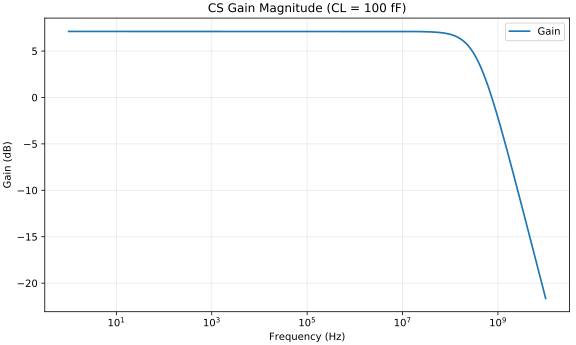
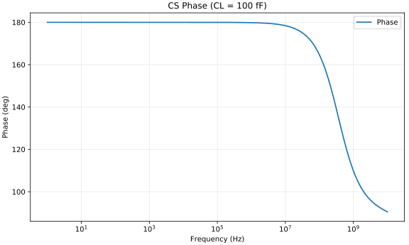

# tb_p01_cs_ac - CL = 100 fF Generated Results

이 문서는 `run_and_plot.py`가 자동 생성한다.

## CS Gain Magnitude (CL = 100 fF)

- 결과 의미: 저주파 이득과 pole에 의한 대역폭 제한을 보여 준다.
- 확인할 것: DC 근처 이득, -3 dB 주파수와 CL 증가에 따른 bandwidth 감소를 확인한다.

## CS Phase (CL = 100 fF)

- 결과 의미: 반전 증폭기 위상과 pole 누적을 보여 준다.
- 확인할 것: 저주파에서 약 180° 반전되고 pole 이후 위상이 추가로 변하는지 확인한다.

## MOS Operating-Point Data

Spectre가 BSIM MOS에 대해 저장한 동작점 parameter이다.

- [operating_point_dc_dcOp.csv](./operating_point_dc_dcOp.csv)

`sat_margin_abs`는 자동 계산한 `|VDS|-|VDSAT|`이다. 최종 영역 판정은 `region`과 함께 확인한다.
