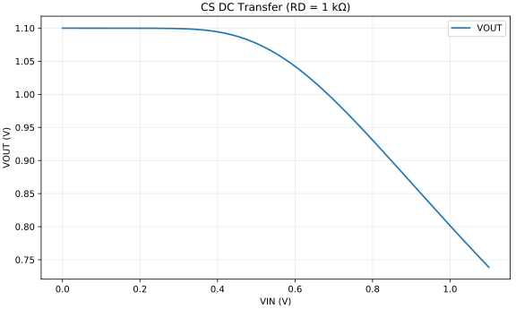
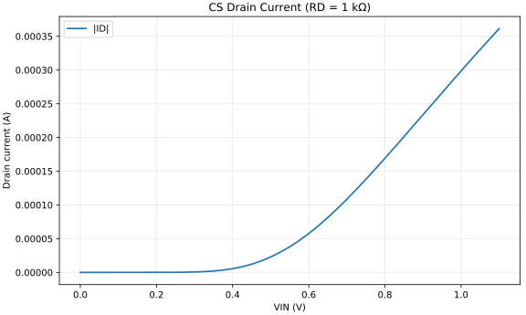

# tb_p01_cs_basic - RD = 1 kΩ Generated Results

이 문서는 `run_and_plot.py`가 자동 생성한다.

## CS DC Transfer (RD = 1 kΩ)

- 결과 의미: CS의 반전 전달 특성과 bias 가능한 구간을 보여 준다.
- 확인할 것: 출력이 rail에 붙는 구간, 음의 기울기 구간과 clipping 경계를 확인한다.

## CS Drain Current (RD = 1 kΩ)

- 결과 의미: 입력 전압에 따라 NMOS가 cutoff에서 conduction 상태로 이동하는 과정을 보여 준다.
- 확인할 것: VOUT 변화가 시작되는 지점과 ID 증가 지점이 일치하는지 확인한다.

## MOS Operating-Point Data

Spectre가 BSIM MOS에 대해 저장한 동작점 parameter이다.

- [operating_point_dc_dc.csv](./operating_point_dc_dc.csv)

`sat_margin_abs`는 자동 계산한 `|VDS|-|VDSAT|`이다. 최종 영역 판정은 `region`과 함께 확인한다.
