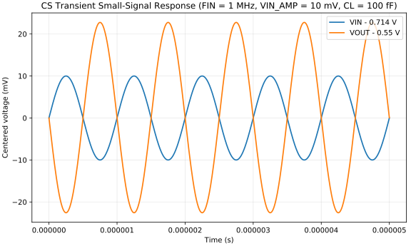

# tb_p01_cs_transient - FIN = 1 MHz, VIN_AMP = 10 mV, CL = 100 fF Generated Results

이 문서는 `run_and_plot.py`가 자동 생성한다.

## CS Transient Small-Signal Response (FIN = 1 MHz, VIN_AMP = 10 mV, CL = 100 fF)

- 결과 의미: DC bias를 제거한 입력과 출력 파형으로 AC small-signal gain과 위상 관계를 시간 영역에서 확인한다.
- 확인할 것: 1 MHz에서 약 2.27 V/V의 반전 이득이 나타나고, -3 dB 주파수에서 출력 진폭이 저주파의 약 0.707배인지 확인한다.

## MOS Operating-Point Data

Spectre가 BSIM MOS에 대해 저장한 동작점 parameter이다.

- [operating_point_dc_dcOp.csv](./operating_point_dc_dcOp.csv)
- [operating_point_tran_tran.csv](./operating_point_tran_tran.csv)

`sat_margin_abs`는 자동 계산한 `|VDS|-|VDSAT|`이다. 최종 영역 판정은 `region`과 함께 확인한다.
