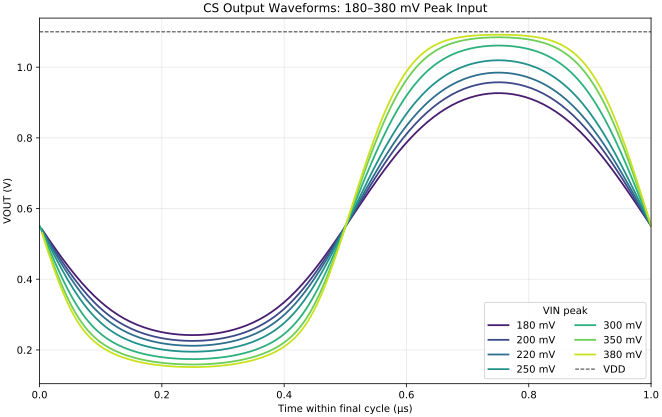

# CS Clipping Sweep

`FIN=1 MHz`, `CL=100 fF`, `VIN_BIAS=0.714 V`에서 입력 peak 진폭을 10–380 mV로 변경하였다. 클리핑 집중 비교 범위는 180–380 mV이다.

수치 데이터는 [`clipping_sweep_measurements.csv`](./clipping_sweep_measurements.csv)에 있다.
